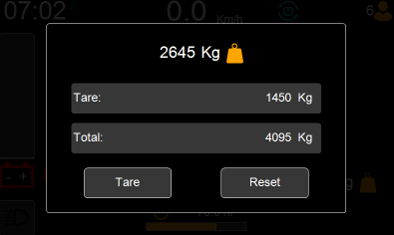

# Load Measurement

Note this feature is not available or applicable for every truck

The load measurement allows the operator to always be aware of the weight of the load on the forks 

As well as the weight of the truck 

The weight of the truck plus the weight of the load on the forks

The weight of the load on the forks can be seen on the home screen and pressing on it brings forth a pop up

The pop of shows:

Tare – weight of forklift by itself

Total – weight of forklift plus load on forks

Reset – Resets total to Zero

