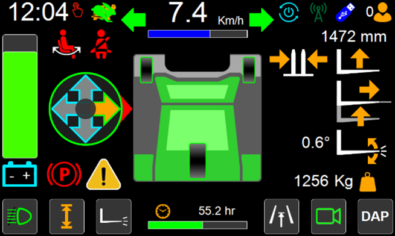
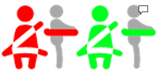
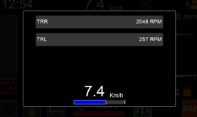
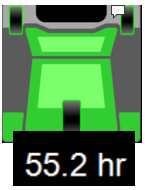
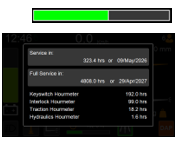
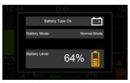
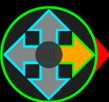

# What is what?

The image illustrates an example of the home screen with some icons visible on the screen. Some of these icons are always visible while others are only displayed under certain conditions. Some of the icons change in appearance depending on conditions. Some icons are interactive and can be pressed to bring up a popup window with more details or to control certain elements such as lights. 
Important Note: truck model in image may differ from users due to being two different model of trucks.

## Touch Screen Ready
The touch screen ready is displayed red upon screen startup and means the screen is currently unresponsive to physical touch apart from operation relating to the work lights, when the touch screen ready is displayed green, the screen will respond to physical touch.

## Slow/Fast Mode
When the turtle is displayed, truck is in slow mode
When the rabbit is displayed, truck is in fast mode

## Clock 
The clock displays the time of day in 24-hour digital format. 

## Seat Switch Indicator  
The seat switch indicator is displayed red when the operator is not sitting in the seat and is displayed green when an operator detected on the seat. 
The drive, steering and hydraulic mast and fork functions are all disabled when this indicator is displayed red.

## Seat Belt Switch Indicator (if fitted)  
The seat belt indicator can only be seen on trucks fitted with an optional seatbelt switch. 
The icon is displayed red when the operator does not have the seat belt fastened. 
The drive is disabled when this indicator is displayed red. 
Steering and hydraulic mast and fork functions may be disabled when this indicator is displayed red depending on the settings.

## Left Turn Indicator (if used) 
This icon can only be seen on trucks fitted with optional road lights. 
The left turn indicator icon is displayed when the left-hand indicator lights are activated

## Speedometer
 The speedometer displays the trucks speed of travel. 

## Speed Indicator Bar 
A coloured bar will be displayed proportional to the trucks speed of travel. 
If active, maximum drive speed will be displayed in a different colour.
Press on bar for more information 

## Right Turn Indicator (if used) 
This icon can only be seen on trucks fitted with optional road lights. 
The right turn indicator icon is displayed when the right-hand indicator lights are activated. 

## Active User  
The active user indicator icon displays the level of the user currently logged in on the display console.

## Lift/Lower Function Indicator 
The lift/lower function indicator is displayed when the forks are being raised or lowered. 
When the forks are being raised the icon will appear with an upward pointing arrow. 
When the forks are being lower the icon will appear with a downward pointing arrow. 
Icon colour might change depending on the function status. 

## Fork Positioning Function Indicator 
The fork positioning function indicator is displayed when the forks are being brought closer together or spread further apart. 
When the forks are being brought closer together the icon will appear with inward pointing arrows. 
When the forks are being spread further apart the icon will appear with outward pointing arrows.
Icon colour might change depending on the function status. 

## Tilt Function Indicator 
The fork tilt function indicator is displayed when the forks are being tilted back or forward. 
When the forks are being tilted back the icon will appear with a curved upward arrow. 
When the forks are being tilted forward the icon will appear with a curved downward arrow.

## Mast/Fork Function Restriction Indicator
The mast/fork function restriction indicator is located in the centre of the screen and forms part of the plan view representation of the truck. 
Icon colour might change depending on the function status. 
Note Icon does not appear for every truck

## Reach Function Indicator 
The reach function indicator is displayed when the reach is being extended or retracted. 
When the reach is being extended an outward pointing arrow will appear between the forks in the centre of the screen. 
When the reach is being retracted an inward pointing arrow will appear between the forks in the centre of the screen. 
Icon colour might change depending on the function status. 

## Wheel Position Indicators  
The wheel position indicators display the angular position of each wheel in real time. 

## Hourmeter 
The hourmeter displays the number of hours of the hourmeter selected in the settings. 

## Maintenance Interval Indicator 
The maintenance interval indicator is a bar that fills from left to right to indicate that next service is due soon. 
When the bar is completely filled the truck must be serviced. 
Resetting the service counters will clear the bar. 
This should only be done after the truck has been serviced. 
Press on the bar to bring up more information

## Park Brake Indicator  
The park brake indicator is displayed on the screen when the park brake is engaged. 

## Fault Warning Indicator 
The fault warning indicator is displayed when a fault has been detected by the trucks electrical control system. 
Press the screen on the fault warning indicator to bring up a list of all the current faults. 
The fault warning indicator will be cleared automatically when faults have been resolved.

## Work Light Switch & Indicator 
The work lights switch and indicator is used to switch the work lights on and off. 
It is also used to determine whether the lights are on or off. Press the screen on the work light icon in the bottom left hand corner of the home screen to activate the work lights. 
Press the screen on the work light icon a second time to deactivate the work lights. 
Press the screen on the work light icon for more than 2s to be given access to extra options. 
The appearance of the icon will change depending on whether the lights are on or off. 

## Battery Information & Battery Discharge Indicator 
The battery icon will change colour to indicate the state of charge of the batteries. 
Press the screen on the battery icon to bring up a pop up showing information on the batteries including their state of charge. 
The battery discharge indicator displays the level of charge remaining in the batteries. 
When the batteries are fully charged the indicator is completely filled to the top in green. 
As the state of charge reduces the colour will also change until it becomes red. 

## Drive Direction Indicator 
The drive direction indicator displays the drive direction that has been selected with the four-way direction control switch. 
It consists of four arrows, any of which can be highlighted depending on the drive direction that has been selected. 
When the four-way direction control switch is in the neutral (centre) position none of the drive direction arrows are highlighted. 
Only the centre circle will be highlighted green. 
When a drive direction is selected an amber arrow pointing in the selected direction will be displayed. 
When the truck is ready to travel in the selected direction the amber arrow will change to green. 

