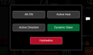

# Controlling the worklights

Press the screen on the work lights icon in the bottom lefthand corner of the home screen for 1 second  and a popup showing different option will appear. 

When selecting one of these options, that mode will be active. After a keyswitch, the mode will revert back to the default one. 

All ON – all worklights are turned ON 

Active Axis – worklights from the same axis will switch ON when active a driving direction on that axis is active. 

Active Direction – worklights from the same active driving direction will be turned ON. 

Dynamic Steer - worklights will be turned ON depending on the turning angle of the truck.

