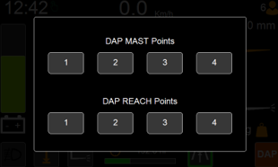
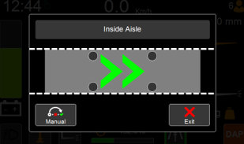

# CINAS

Note this feature is not available or applicable for every truck

The CINAS – Combi IN Aisle System, allows the truck to drive in/trough narrow aisles without steering input from the operator. 

The in-aisle system activates when two of the four sensors (grey circles on screen), detects a marker/flag in a set sequence when approaching the aisle.

When in-aisle an arrow appears to show direction, truck is driving in.

The manual button, manually activates the in-aisle system, bypassing the sensor activation sequence.

