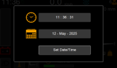
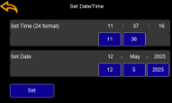

# Changing Time and Date

Press the clock in the top left-hand corner of the home screen and a popup showing the time and date will appear.

Press Set Date/Time and the ‘Set Date/Time’ will appear

Press on one of the blue boxes to bring up the numpad and use it to change the time and date.

Press Set to apply the new values

