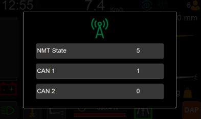

# Telematics

Note this feature is not available or applicable for every truck

Accessed by pressing on the antenna icon, which is found on the top right side of the screen.

The pop up shows the network management state, it also shows what CAN network the telematics device is connected to.

