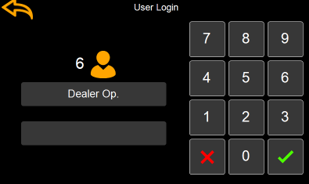

# Login

The login screen allows users to enter their password to gain their user access level. 

Use the digits to insert the user password. 

Use X to clear the inserted code. 

If the wrong code is inserted, a message will be shown and the code will be cleared for a new try. 

If the correct password has been inserted, the screen will return the previous screen or to the home screen.

