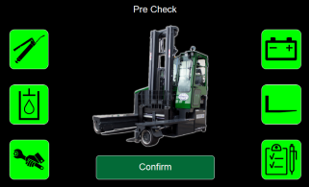

# Pre-Operation Check

When enabled in the settings, a screen will be shown on keyswitch ON to remember the driver to do the machine inspections before operating the truck. 

In mode 1, the screen only asks for a confirmation. 

In mode 2, the screen asks for a confirmation of individual tasks to be performed. 

These tasks are signalled by the icons on the left and right of the screen.

Confirmation button will only be available when all the tasks have been selected as completed (green).

