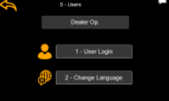

# User Info

Press the screen on the user icon in the top right-hand corner of the home screen and a popup showing user info will appear. 

It is possible to see the current logged in user’s level, and options to change user and change language.

